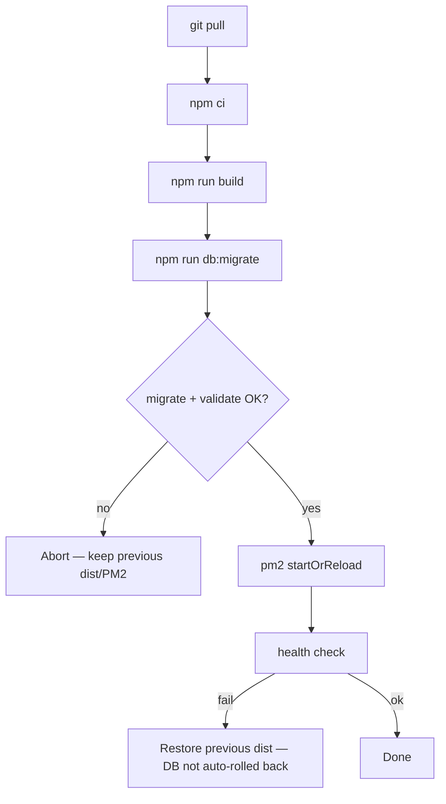

# Database Migration Framework

Structured, versioned MySQL migrations for Digital House.

**Policy (authoritative):** [DATABASE_POLICY.md](./DATABASE_POLICY.md)  
**Live audit checklist:** [DATABASE_LIVE_AUDIT.md](./DATABASE_LIVE_AUDIT.md) — optional runner: `npm run db:audit:live`

## Status

| Rule | Detail |
|------|--------|
| Schema redesign | **Frozen** (no ENUM replace, CHECK, renames, posts split) |
| Deploy path | `npm run db:migrate` only |
| Legacy `db:run-*` | **Deprecated** — emergency only with `ALLOW_LEGACY_DB_SCRIPTS=1` + ticket + backup |
| `sequelize.sync()` | **Local development empty DBs only** — never staging/production/shared |

## Migration plan

| Phase | Action | Status |
|-------|--------|--------|
| 1 | Introduce `schema_migrations` history + CLI under `scripts/migrate/` | Done |
| 2 | Move deploy-critical DDL into `db/migrations/<version>_<name>/` | Started (`media_jobs_queue`) |
| 3 | Existing prod: `db:migrate` (idempotent) or careful `db:migrate:baseline` when porting history | Ops |
| 4 | New schema changes **only** via `db:migrate:new` + Migration Review Checklist | **Policy** |
| 5 | Legacy runners frozen/deprecated; do not add new ones | **Policy** |
| 6 | Expand `db/expectations/*.json` as additive migrations land | Ongoing |
| 7 | Live audit (ENUM/indexes/FKs/duplicates/EXPLAIN) | **Done** — [FINDINGS-20260731](./audit-reports/FINDINGS-20260731.md) |

## Folder structure

```text
db/
  migrations/
    20260731130000_media_jobs_queue/
      meta.json
      up.js | up.sql
      down.js | down.sql   # optional
  expectations/
    core.json
scripts/migrate/           # CLI runner
migrations/                # LEGACY reference SQL (deprecated for apply)
```

Version folder name: `YYYYMMDDHHMMSS_snake_case` (UTC timestamp).

## Commands

```bash
npm run db:migrate              # apply pending + validate
npm run db:migrate:status
npm run db:migrate:down         # only if meta.rollback allows
npm run db:migrate:baseline     # mark applied without DDL — use carefully
npm run db:migrate:validate
npm run db:migrate:new -- add_foo_column
```

## Legacy scripts (deprecated)

Do **not** use `npm run db:run-*` for normal work. Files are retained for history.

npm scripts are gated by `scripts/legacy-db-guard.js`:

```bash
# refused
npm run db:run-user-soft-delete-sql

# emergency only — ticket + backup first
ALLOW_LEGACY_DB_SCRIPTS=1 npm run db:run-user-soft-delete-sql
```

Never casually re-run scripts that `MODIFY` `users.status` ENUM.

## History tracking

Table `schema_migrations` stores `version`, `name`, `checksum`, `applied_at`, `direction`. Concurrent deploys take `GET_LOCK('digitalhouse_schema_migrate')`.

## Deployment flow



Before staging/prod migrate: complete **backup verification** and the **Migration Review Checklist** in [DATABASE_POLICY.md](./DATABASE_POLICY.md).

## Rollback strategy

| Situation | Action |
|-----------|--------|
| Reversible down + `meta.rollback: true` | `db:migrate:down` before old app binary |
| Irreversible | Backup restore or forward-fix migration |
| Checksum drift | Never edit applied ups — add a new version |

## Creating a migration

```bash
npm run db:migrate:new -- users_add_locale
# Complete Migration Review Checklist in the PR
npm run db:migrate:status
npm run db:migrate
```

See [DATABASE_POLICY.md](./DATABASE_POLICY.md) §6 for the full checklist (additive, rollback, online assessment, downtime, prior-app compatibility).
