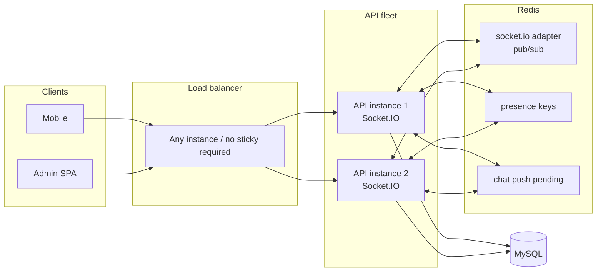

# Redis Socket Architecture

Multi-instance Socket.IO for Digital House: shared adapter, distributed presence, shared rooms/events. Client Socket.IO event names and HTTP APIs are unchanged.

## When Redis is required

| Mode | `REDIS_URL` | API instances | Behavior |
|------|-------------|---------------|----------|
| Local / single | unset | `1` | In-memory adapter + presence (process-local) |
| Multi-instance | set | `N ≥ 1` | Redis adapter + Redis presence + cross-instance push cancel |

Without Redis, do **not** run more than one `digitalhouse-api` process.

## Architecture



### Data paths

1. **Rooms / emits** — `@socket.io/redis-adapter` publishes room membership and `io.to(...).emit(...)` across instances. Rooms stay `user:{id}`, `community:{c}`, `presence:{id}`.
2. **Presence** — Redis SETs/hashes keyed by user and `serverId:socketId` refs. Heartbeats expire dead servers (~45s); reconcile strips stale refs.
3. **Chat push grace** — Pending push markers live in Redis so delivery ack on instance B cancels a timer scheduled on instance A.
4. **Shutdown** — `shutdownRealtime()` clears this process’s presence refs and quits Redis clients.

## Redis key design

Prefix: `REDIS_KEY_PREFIX` (default `dh`).

| Key | Type | Purpose | TTL |
|-----|------|---------|-----|
| `{p}:presence:online` | SET | User IDs currently online | — |
| `{p}:presence:user:{userId}:sockets` | SET | Socket refs for a user | — |
| `{p}:presence:socket:{serverId}:{socketId}` | STRING | userId for that socket ref | — |
| `{p}:presence:server:{serverId}:sockets` | SET | Refs owned by one API process | — |
| `{p}:presence:server:{serverId}:hb` | STRING | Liveness heartbeat | ~45s |
| `{p}:presence:servers` | SET | Known API server IDs | — |
| `{p}:presence:lastseen` | HASH | userId → epoch ms | pruned by age |
| `{p}:chat:push:pending:{messageId}` | STRING | JSON job; cancel if deleted | grace + 2s |
| Socket.IO adapter channels | pub/sub | Internal to `@socket.io/redis-adapter` | — |

Socket refs are `{hostname}-{pid}-{rand}:{socketId}` so two processes never collide on the same Socket.IO id space.

## Deployment changes

1. **Provision Redis** (managed or local). Prefer TLS (`rediss://`) in production.
2. **Env on API** (`.env` / PM2 / Railway):

```bash
REDIS_URL=redis://:password@127.0.0.1:6379/0
# optional
REDIS_KEY_PREFIX=dh
CHAT_PUSH_GRACE_MS=6000
```

3. **PM2** — `ecosystem.config.cjs` passes `REDIS_URL` / `REDIS_KEY_PREFIX` into `digitalhouse-api`. After Redis is healthy you may raise `instances` (watch MySQL `DB_POOL_MAX` budget).
4. **Load balancer** — Sticky sessions optional for Socket.IO once the Redis adapter is on. Still useful for HTTP connection reuse, not required for room correctness.
5. **Workers** — Media and scheduler do **not** need Redis for sockets; only API.
6. **Verify boot log**:

```
[socket] Redis adapter enabled (presence server=...)
```

If Redis is down, the API falls back to in-memory adapter and logs a warning — treat that as single-instance only until Redis recovers.

## Scalability

- **Horizontal Socket.IO**: each API process holds its own TCP sockets; Redis fans out emits and shares presence. Capacity ≈ sum of instance connection limits, bounded by Redis pub/sub throughput and MySQL pool size.
- **Presence cost**: O(1) online check (`SISMEMBER`); connect/disconnect pipelines; crash cleanup via HB TTL + periodic reconcile.
- **Failure modes**: Redis outage → degraded single-node realtime per process (do not scale out while degraded). API crash → HB expires → other instances mark users offline if no remaining sockets.
- **What stays process-local**: the short-lived push timer Map (coordination is the Redis pending key). Plan/settings caches elsewhere are still per-process (out of scope here).

## Client / API compatibility

Unchanged for clients:

- Socket auth (`auth.token` / `Authorization` / query)
- Events: `presence:*`, `typing`, `message:send|delivered|read`, feed events via rooms
- HTTP responses that include `online` / last-seen (server awaits Redis presence)

Server modules that previously called sync `isOnline` / `getLastSeenAt` now `await` the same names.
